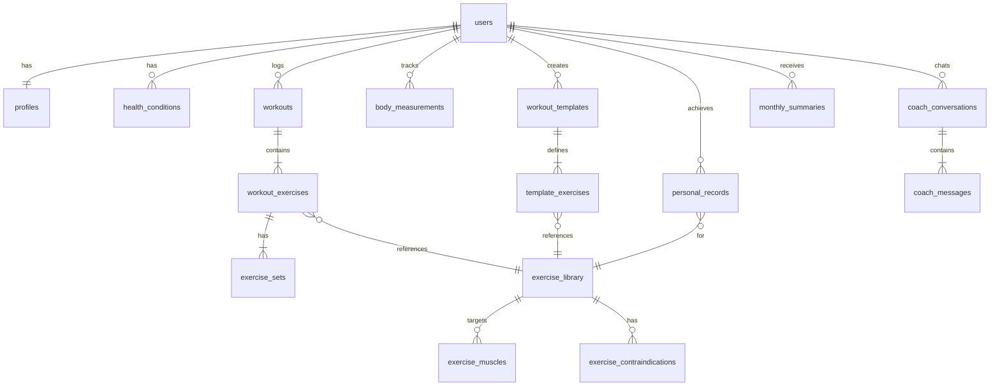

# Pulse Fitness — Database Schema

> **Database:** Neon (PostgreSQL 16, serverless)
> **Auth:** Self-managed in FastAPI (passlib + python-jose JWT)
> **Access Control:** Enforced at the API layer via `get_current_user` dependency — no RLS needed.

## Entity Relationship Diagram



---

## Tables

### 0. `users`
Self-managed auth table. Stores credentials only — profile data lives in `profiles`.

| Column | Type | Constraints | Notes |
|--------|------|-------------|-------|
| `id` | `uuid` | PK, DEFAULT `gen_random_uuid()` | Referenced by all other tables |
| `email` | `text` | NOT NULL, UNIQUE | Login identifier |
| `password_hash` | `text` | NOT NULL | Hashed via bcrypt (passlib) |
| `created_at` | `timestamptz` | DEFAULT `now()` | |

> [!NOTE]
> A trigger auto-creates a `profiles` row when a new user is inserted. Password is never stored in plain text — always hashed with bcrypt.

---

### 1. `profiles`
One row per user. Auto-created via trigger on `users` insert.

| Column | Type | Constraints | Notes |
|--------|------|-------------|-------|
| `id` | `uuid` | PK, DEFAULT `gen_random_uuid()` | |
| `user_id` | `uuid` | FK → `users(id)`, NOT NULL, UNIQUE | One-to-one with users |
| `display_name` | `text` | NOT NULL, DEFAULT `'User'` | "Harsh", "Mom", "Dad" |
| `email` | `text` | NOT NULL | Copied from users table |
| `date_of_birth` | `date` | | Better than storing age (age changes!) |
| `gender` | `text` | CHECK `('male','female','other')` | For AI recommendation calibration |
| `weight_lbs` | `decimal(5,1)` | | Current weight, updated via Profile page |
| `height_inches` | `integer` | | Store total inches; convert to ft/in in UI |
| `fitness_level` | `text` | CHECK `('beginner','intermediate','advanced')` | Affects AI suggestions |
| `avatar_url` | `text` | | Optional profile photo |
| `created_at` | `timestamptz` | DEFAULT `now()` | |
| `updated_at` | `timestamptz` | DEFAULT `now()` | Auto-updated via trigger |

---

### 2. `health_conditions`
Tracks injuries, sensitivities, conditions per user. **Critical for AI safety.**

| Column | Type | Constraints | Notes |
|--------|------|-------------|-------|
| `id` | `uuid` | PK, DEFAULT `gen_random_uuid()` | |
| `user_id` | `uuid` | FK → `users(id)`, NOT NULL | |
| `condition_name` | `text` | NOT NULL | "PFPS", "Lower Back Pain", "Shoulder Impingement" |
| `body_area` | `text` | NOT NULL | "right_knee", "lower_back", "left_shoulder" |
| `severity` | `text` | CHECK `('mild','moderate','severe')` | |
| `notes` | `text` | | Free-form: "Clicking when going below parallel" |
| `diagnosed_date` | `date` | | |
| `is_active` | `boolean` | DEFAULT `true` | Mark resolved conditions inactive |
| `created_at` | `timestamptz` | DEFAULT `now()` | |

> [!IMPORTANT]
> This table replaces the free-text `health_notes` field from Profile. Structured data lets the AI agent query specific conditions and body areas, rather than parsing free text.

---

### 3. `exercise_library`
Master catalog of all exercises. System-seeded + user-created.

| Column | Type | Constraints | Notes |
|--------|------|-------------|-------|
| `id` | `uuid` | PK, DEFAULT `gen_random_uuid()` | |
| `name` | `text` | NOT NULL, UNIQUE | "Barbell Back Squat" |
| `category` | `text` | CHECK `('strength','cardio','flexibility','rehab')` | |
| `equipment` | `text` | CHECK `('barbell','dumbbell','machine','cable','band','bodyweight','kettlebell','other')` | |
| `difficulty` | `text` | CHECK `('beginner','intermediate','advanced')` | |
| `instructions` | `text` | | Brief form cues |
| `is_compound` | `boolean` | DEFAULT `false` | Compound vs isolation |
| `is_system` | `boolean` | DEFAULT `false` | `true` = seeded, can't delete |
| `created_by` | `uuid` | FK → `users(id)`, NULLABLE | NULL for system exercises |
| `created_at` | `timestamptz` | DEFAULT `now()` | |

---

### 4. `exercise_muscles`
Many-to-many: which muscles each exercise targets.

| Column | Type | Constraints | Notes |
|--------|------|-------------|-------|
| `id` | `uuid` | PK, DEFAULT `gen_random_uuid()` | |
| `exercise_id` | `uuid` | FK → `exercise_library(id)`, ON DELETE CASCADE | |
| `muscle_group` | `text` | NOT NULL | See enum below |
| `role` | `text` | CHECK `('primary','secondary','stabilizer')` | |
| UNIQUE | | `(exercise_id, muscle_group)` | No duplicate mappings |

**Muscle groups**: `quads`, `hamstrings`, `glutes`, `chest`, `upper_back`, `lower_back`, `shoulders`, `biceps`, `triceps`, `core`, `calves`, `forearms`, `hip_flexors`

---

### 5. `exercise_contraindications`
Which exercises to avoid/modify for specific conditions. **Powers the AI safety layer.**

| Column | Type | Constraints | Notes |
|--------|------|-------------|-------|
| `id` | `uuid` | PK, DEFAULT `gen_random_uuid()` | |
| `exercise_id` | `uuid` | FK → `exercise_library(id)`, ON DELETE CASCADE | |
| `condition_name` | `text` | NOT NULL | Matches `health_conditions.condition_name` |
| `risk_level` | `text` | CHECK `('avoid','modify','caution')` | |
| `modification_notes` | `text` | | "Limit ROM above parallel" |
| `alternative_exercise_id` | `uuid` | FK → `exercise_library(id)`, NULLABLE | Suggested safe swap |

> [!TIP]
> Example: Barbell Back Squat + PFPS → `risk_level: 'modify'`, `modification_notes: 'Use box squat above parallel, keep weight moderate'`, `alternative: Leg Press`

---

### 6. `workouts`
One row per workout session.

| Column | Type | Constraints | Notes |
|--------|------|-------------|-------|
| `id` | `uuid` | PK, DEFAULT `gen_random_uuid()` | |
| `user_id` | `uuid` | FK → `users(id)`, NOT NULL | |
| `started_at` | `timestamptz` | NOT NULL, DEFAULT `now()` | When they tapped "Start Workout" |
| `completed_at` | `timestamptz` | NULLABLE | NULL = in progress |
| `title` | `text` | | "Upper Body Power", auto-generated or user-set |
| `workout_type` | `text` | CHECK `('strength','cardio','flexibility','mixed')` | |
| `notes` | `text` | | Post-workout notes |
| `rating` | `smallint` | CHECK `(1-5)`, NULLABLE | How the workout felt |
| `energy_level` | `smallint` | CHECK `(1-5)`, NULLABLE | Pre-workout energy |
| `pain_notes` | `text` | NULLABLE | "Knee clicked during set 3 of squats" |
| `duration_mins` | `integer` | | Computed in app or on completion |
| `is_deleted` | `boolean` | DEFAULT `false` | Soft delete |
| `created_at` | `timestamptz` | DEFAULT `now()` | |

---

### 7. `workout_exercises`
Exercises performed within a specific workout.

| Column | Type | Constraints | Notes |
|--------|------|-------------|-------|
| `id` | `uuid` | PK, DEFAULT `gen_random_uuid()` | |
| `workout_id` | `uuid` | FK → `workouts(id)`, ON DELETE CASCADE | |
| `exercise_id` | `uuid` | FK → `exercise_library(id)` | |
| `sort_order` | `smallint` | NOT NULL | Display ordering |
| `notes` | `text` | | Per-exercise notes |
| `rest_seconds` | `smallint` | DEFAULT `90` | Rest between sets |

---

### 8. `exercise_sets`
Individual sets within a workout exercise.

| Column | Type | Constraints | Notes |
|--------|------|-------------|-------|
| `id` | `uuid` | PK, DEFAULT `gen_random_uuid()` | |
| `workout_exercise_id` | `uuid` | FK → `workout_exercises(id)`, ON DELETE CASCADE | |
| `set_number` | `smallint` | NOT NULL | 1, 2, 3... |
| `set_type` | `text` | CHECK `('warmup','working','dropset','failure','amrap')` | DEFAULT `'working'` |
| `weight_lbs` | `decimal(6,1)` | | NULL for bodyweight exercises |
| `reps` | `smallint` | | NULL for timed exercises |
| `duration_seconds` | `smallint` | | For planks, timed holds |
| `distance_meters` | `decimal(8,1)` | | For cardio (running, rowing) |
| `is_completed` | `boolean` | DEFAULT `false` | Checkbox in ExerciseCard |
| `rpe` | `smallint` | CHECK `(1-10)`, NULLABLE | Rate of Perceived Exertion |
| `created_at` | `timestamptz` | DEFAULT `now()` | |

---

### 9. `body_measurements`
Track weight and body composition over time.

| Column | Type | Constraints | Notes |
|--------|------|-------------|-------|
| `id` | `uuid` | PK, DEFAULT `gen_random_uuid()` | |
| `user_id` | `uuid` | FK → `users(id)`, NOT NULL | |
| `measured_at` | `date` | NOT NULL | |
| `weight_lbs` | `decimal(5,1)` | | |
| `body_fat_pct` | `decimal(4,1)` | NULLABLE | Optional |
| `notes` | `text` | | |
| UNIQUE | | `(user_id, measured_at)` | One measurement per day |

---

### 10. `workout_templates`
Saved routines users can quickly start.

| Column | Type | Constraints | Notes |
|--------|------|-------------|-------|
| `id` | `uuid` | PK, DEFAULT `gen_random_uuid()` | |
| `user_id` | `uuid` | FK → `users(id)`, NOT NULL | |
| `name` | `text` | NOT NULL | "Leg Day", "Push Day" |
| `description` | `text` | | |
| `workout_type` | `text` | CHECK `('strength','cardio','flexibility','mixed')` | |
| `created_at` | `timestamptz` | DEFAULT `now()` | |
| `updated_at` | `timestamptz` | DEFAULT `now()` | |

### 11. `template_exercises`
Exercises that make up a template.

| Column | Type | Constraints | Notes |
|--------|------|-------------|-------|
| `id` | `uuid` | PK, DEFAULT `gen_random_uuid()` | |
| `template_id` | `uuid` | FK → `workout_templates(id)`, ON DELETE CASCADE | |
| `exercise_id` | `uuid` | FK → `exercise_library(id)` | |
| `sort_order` | `smallint` | NOT NULL | |
| `target_sets` | `smallint` | DEFAULT `3` | |
| `target_reps` | `smallint` | DEFAULT `10` | |
| `target_weight_lbs` | `decimal(6,1)` | NULLABLE | |

---

### 12. `personal_records`
Cached PRs per exercise. Updated via trigger after each workout.

| Column | Type | Constraints | Notes |
|--------|------|-------------|-------|
| `id` | `uuid` | PK, DEFAULT `gen_random_uuid()` | |
| `user_id` | `uuid` | FK → `users(id)`, NOT NULL | |
| `exercise_id` | `uuid` | FK → `exercise_library(id)`, NOT NULL | |
| `record_type` | `text` | CHECK `('max_weight','max_reps','max_volume','est_1rm')` | |
| `value` | `decimal(8,1)` | NOT NULL | |
| `achieved_at` | `date` | NOT NULL | |
| `workout_id` | `uuid` | FK → `workouts(id)` | Which workout set the PR |
| UNIQUE | | `(user_id, exercise_id, record_type)` | One PR per type per exercise |

---

### 13. `coach_conversations`
AI chat threads.

| Column | Type | Constraints | Notes |
|--------|------|-------------|-------|
| `id` | `uuid` | PK, DEFAULT `gen_random_uuid()` | |
| `user_id` | `uuid` | FK → `users(id)`, NOT NULL | |
| `title` | `text` | | Auto-generated from first message |
| `created_at` | `timestamptz` | DEFAULT `now()` | |
| `updated_at` | `timestamptz` | DEFAULT `now()` | |

### 14. `coach_messages`
Individual messages within a conversation.

| Column | Type | Constraints | Notes |
|--------|------|-------------|-------|
| `id` | `uuid` | PK, DEFAULT `gen_random_uuid()` | |
| `conversation_id` | `uuid` | FK → `coach_conversations(id)`, ON DELETE CASCADE | |
| `role` | `text` | CHECK `('user','assistant','system')` | |
| `content` | `text` | NOT NULL | Message body |
| `metadata` | `jsonb` | DEFAULT `'{}'` | Suggested exercises, structured AI output |
| `created_at` | `timestamptz` | DEFAULT `now()` | |

---

### 15. `monthly_summaries`
AI-generated monthly reports.

| Column | Type | Constraints | Notes |
|--------|------|-------------|-------|
| `id` | `uuid` | PK, DEFAULT `gen_random_uuid()` | |
| `user_id` | `uuid` | FK → `users(id)`, NOT NULL | |
| `month` | `date` | NOT NULL | 1st of month: `'2026-04-01'` |
| `stats` | `jsonb` | NOT NULL | `{total_workouts, total_volume, total_duration, ...}` |
| `muscle_group_breakdown` | `jsonb` | | `{quads: 40%, glutes: 25%, ...}` |
| `ai_observations` | `text` | | Paragraph of AI analysis |
| `ai_suggestions` | `jsonb` | | `["Add hip thrusts 2x/week", ...]` |
| `created_at` | `timestamptz` | DEFAULT `now()` | |
| UNIQUE | | `(user_id, month)` | One summary per user per month |

---

## Indexes

```sql
CREATE INDEX idx_workouts_user_date ON workouts(user_id, started_at DESC);
CREATE INDEX idx_workouts_not_deleted ON workouts(user_id) WHERE is_deleted = false;
CREATE INDEX idx_workout_exercises_workout ON workout_exercises(workout_id);
CREATE INDEX idx_exercise_sets_workout_ex ON exercise_sets(workout_exercise_id);
CREATE INDEX idx_exercise_muscles_exercise ON exercise_muscles(exercise_id);
CREATE INDEX idx_exercise_muscles_group ON exercise_muscles(muscle_group);
CREATE INDEX idx_health_conditions_user ON health_conditions(user_id) WHERE is_active = true;
CREATE INDEX idx_body_measurements_user ON body_measurements(user_id, measured_at DESC);
CREATE INDEX idx_personal_records_user ON personal_records(user_id, exercise_id);
CREATE INDEX idx_coach_messages_convo ON coach_messages(conversation_id, created_at);
CREATE INDEX idx_exercise_library_search ON exercise_library USING gin(to_tsvector('english', name));
```

---

## Access Control

> [!NOTE]
> **No RLS.** Access control is enforced in the FastAPI backend. Every protected endpoint uses the `get_current_user` dependency to extract the `user_id` from the JWT, then filters all queries with `WHERE user_id = $1`.

```python
# Example: FastAPI endpoint with access control
@router.get("/workouts")
async def list_workouts(
    user_id: str = Depends(get_current_user),
    db: Connection = Depends(get_db),
):
    rows = await db.fetch(
        "SELECT * FROM workouts WHERE user_id = $1 AND is_deleted = false ORDER BY started_at DESC",
        user_id
    )
    return rows
```

For child tables (`workout_exercises`, `exercise_sets`, etc.), verify ownership by joining to the parent:
```python
# Verify the workout belongs to the user before returning exercises
workout = await db.fetchrow("SELECT id FROM workouts WHERE id = $1 AND user_id = $2", workout_id, user_id)
if not workout:
    raise HTTPException(status_code=404)
```

---

## Triggers

```sql
-- Auto-update updated_at columns
CREATE OR REPLACE FUNCTION update_updated_at()
RETURNS TRIGGER AS $$
BEGIN
    NEW.updated_at = now();
    RETURN NEW;
END;
$$ LANGUAGE plpgsql;

CREATE TRIGGER set_updated_at BEFORE UPDATE ON profiles
    FOR EACH ROW EXECUTE FUNCTION update_updated_at();
CREATE TRIGGER set_updated_at BEFORE UPDATE ON workout_templates
    FOR EACH ROW EXECUTE FUNCTION update_updated_at();
CREATE TRIGGER set_updated_at BEFORE UPDATE ON coach_conversations
    FOR EACH ROW EXECUTE FUNCTION update_updated_at();

-- Auto-create profile when a user signs up
CREATE OR REPLACE FUNCTION handle_new_user()
RETURNS TRIGGER AS $$
BEGIN
    INSERT INTO profiles (user_id, email, display_name)
    VALUES (NEW.id, NEW.email, 'User');
    RETURN NEW;
END;
$$ LANGUAGE plpgsql;

CREATE TRIGGER on_user_created
    AFTER INSERT ON users
    FOR EACH ROW EXECUTE FUNCTION handle_new_user();
```

---

## Key Query Examples

```sql
-- Dashboard: "Recent Workouts" card
SELECT w.id, w.started_at, w.title, w.workout_type, w.duration_mins,
       COUNT(we.id) as exercise_count
FROM workouts w
LEFT JOIN workout_exercises we ON we.workout_id = w.id
WHERE w.user_id = $1 AND w.is_deleted = false
GROUP BY w.id
ORDER BY w.started_at DESC
LIMIT 5;

-- History: Full workout detail with exercises + sets
SELECT w.*, we.sort_order, el.name as exercise_name,
       es.set_number, es.weight_lbs, es.reps, es.set_type
FROM workouts w
JOIN workout_exercises we ON we.workout_id = w.id
JOIN exercise_library el ON el.id = we.exercise_id
JOIN exercise_sets es ON es.workout_exercise_id = we.id
WHERE w.id = $1 AND w.user_id = $2
ORDER BY we.sort_order, es.set_number;

-- AI Coach: Get user's volume per muscle group (last 30 days)
SELECT em.muscle_group,
       SUM(es.weight_lbs * es.reps) as total_volume
FROM workouts w
JOIN workout_exercises we ON we.workout_id = w.id
JOIN exercise_sets es ON es.workout_exercise_id = we.id
JOIN exercise_muscles em ON em.exercise_id = we.exercise_id
WHERE w.user_id = $1
  AND w.started_at >= NOW() - INTERVAL '30 days'
  AND em.role = 'primary'
GROUP BY em.muscle_group
ORDER BY total_volume DESC;

-- AI Coach: Find safe exercise alternatives for a user's condition
SELECT el.name, el.equipment, ec.modification_notes,
       alt.name as alternative_name
FROM exercise_contraindications ec
JOIN exercise_library el ON el.id = ec.exercise_id
LEFT JOIN exercise_library alt ON alt.id = ec.alternative_exercise_id
JOIN health_conditions hc ON hc.condition_name = ec.condition_name
WHERE hc.user_id = $1 AND hc.is_active = true
  AND ec.risk_level = 'avoid';
```
