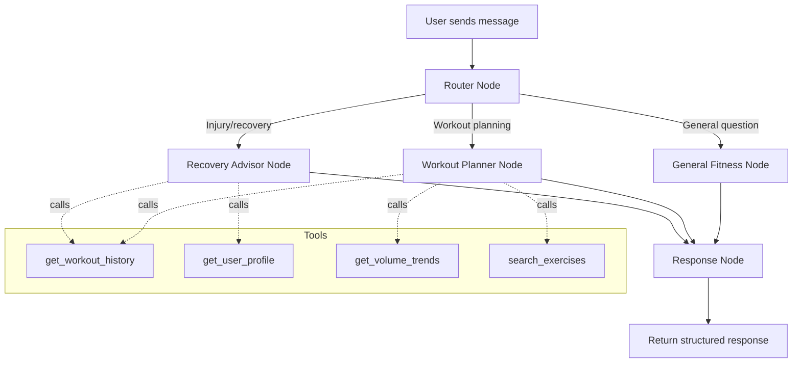

# Backend, Database & AI Integration — Task List

## Confirmed Tech Stack

| Layer | Technology | Notes |
|-------|-----------|-------|
| Backend | **Python 3.12 + FastAPI** | Async, OpenAPI docs auto-gen, great AI ecosystem |
| Database | **Supabase (PostgreSQL 15)** | Hosted, free tier, auth, RLS, real-time |
| AI/Agents | **LangGraph + Gemini 2.5 Flash** | Multi-step reasoning, structured output |
| Local Storage | **IndexedDB via Dexie.js** | Offline-first for Capacitor |
| Auth | **Supabase Auth** | Email/password, no OAuth complexity needed for 3 users |
| Hosting | **Railway / Fly.io** | FastAPI backend. Supabase is self-hosted. |

---

## Phase 1: Database Schema & Supabase Setup
> **Goal**: Production-ready schema that supports the full app data model.

### Tasks

- [ ] **1.1** Create Supabase project and configure environment
  - Set up `.env` with `SUPABASE_URL`, `SUPABASE_ANON_KEY`, `SUPABASE_SERVICE_KEY`
  - Configure CORS for `localhost:3000` and eventual Capacitor origin

- [ ] **1.2** Design and apply database schema
  ```sql
  -- Core tables
  profiles        (id, user_id FK, display_name, email, age, weight_lbs, height_ft, height_in, health_notes, avatar_url, created_at, updated_at)
  workouts        (id, user_id FK, date, title, duration_mins, notes, created_at)
  exercises       (id, workout_id FK, name, sort_order)
  sets            (id, exercise_id FK, set_number, weight_lbs, reps, type['working','warmup','dropset'], completed)
  exercise_library(id, name, muscle_group, equipment, is_custom, created_by FK)
  ```

- [ ] **1.3** Set up Row-Level Security (RLS)
  - Each user can only read/write their own `workouts`, `exercises`, `sets`, `profiles`
  - `exercise_library` is read-all, write-own for custom exercises

- [ ] **1.4** Seed the `exercise_library` table
  - ~50 common exercises (Barbell Squat, Bench Press, Overhead Press, etc.)
  - Include `muscle_group` tags (quads, glutes, chest, back, etc.) for AI filtering
  - Flag rehab-friendly exercises (leg press, hip thrust, etc.)

- [ ] **1.5** Create database indexes
  - `workouts(user_id, date DESC)` — for history page pagination
  - `exercises(workout_id)` — for loading workout details
  - `sets(exercise_id)` — for loading set data

---

## Phase 2: FastAPI Backend
> **Goal**: REST API that the Next.js frontend calls for all CRUD + sync.

### Tasks

- [ ] **2.1** Scaffold FastAPI project
  ```
  backend/
  ├── app/
  │   ├── main.py              # FastAPI app, CORS, lifespan
  │   ├── config.py            # Pydantic Settings (env vars)
  │   ├── dependencies.py      # Supabase client injection
  │   ├── routers/
  │   │   ├── auth.py          # Login, signup, token refresh
  │   │   ├── workouts.py      # CRUD for workouts + exercises + sets
  │   │   ├── profile.py       # GET/PUT user profile + vitals
  │   │   ├── exercise_library.py  # Search exercises
  │   │   └── coach.py         # AI coach endpoints
  │   ├── models/              # Pydantic request/response schemas
  │   ├── services/
  │   │   ├── workout_service.py
  │   │   ├── analytics_service.py  # Volume calc, streak tracking
  │   │   └── ai_coach_service.py   # LangGraph agent
  │   └── agents/
  │       ├── coach_graph.py    # LangGraph state machine
  │       └── tools.py          # Tool definitions for the agent
  ├── requirements.txt
  └── Dockerfile
  ```

- [ ] **2.2** Implement Auth endpoints
  - `POST /auth/signup` — Create account (email + password via Supabase)
  - `POST /auth/login` — Returns JWT
  - `POST /auth/refresh` — Refresh expired token
  - Middleware: validate Supabase JWT on all protected routes

- [ ] **2.3** Implement Workout CRUD
  - `POST /workouts` — Create workout (with nested exercises + sets)
  - `GET /workouts?limit=20&offset=0` — Paginated history
  - `GET /workouts/{id}` — Single workout with all exercises/sets
  - `PUT /workouts/{id}` — Update workout metadata
  - `DELETE /workouts/{id}` — Soft delete

- [ ] **2.4** Implement Profile endpoints
  - `GET /profile` — Fetch current user's vitals + health notes
  - `PUT /profile` — Update age, weight, height, health notes

- [ ] **2.5** Implement Exercise Library search
  - `GET /exercises/search?q=squat&muscle_group=quads`
  - Returns matching exercises from library + user's custom exercises
  - Used by the `AddExerciseModal` on the frontend

- [ ] **2.6** Implement Analytics service
  - `GET /analytics/summary` — Monthly overview data (workout count, total volume, active time)
  - `GET /analytics/volume?exercise=barbell_squat&months=6` — Volume progression
  - Powers the Dashboard bento cards and Coach progress rings

---

## Phase 3: Frontend ↔ Backend Integration
> **Goal**: Replace all hardcoded mock data with real API calls + offline support.

### Tasks

- [ ] **3.1** Install and configure Supabase client
  - `npm install @supabase/supabase-js`
  - Create `lib/supabase.ts` with typed client
  - Set up auth state listener in root layout

- [ ] **3.2** Set up Dexie.js for offline-first IndexedDB
  - `npm install dexie`
  - Create `lib/db.ts` with local schema mirroring Supabase tables
  - Implement write-to-local-first, sync-to-cloud pattern

- [ ] **3.3** Build data hooks
  - `useWorkouts()` — Fetch from IndexedDB, background sync with Supabase
  - `useProfile()` — Local-first profile with cloud backup
  - `useExerciseLibrary(query)` — Search with debounce
  - `useAnalytics()` — Monthly summary data

- [ ] **3.4** Wire up existing pages
  - **Dashboard**: Replace hardcoded "2,450 kcal" / "4h 15m" with `useAnalytics()`
  - **Workout page**: Save completed workout via `POST /workouts`
  - **History page**: Fetch from `useWorkouts()` instead of `MOCK_HISTORY`
  - **Profile page**: Load/save with `useProfile()`
  - **Coach page**: Replace static rings with `useAnalytics()`

- [ ] **3.5** Add auth flow
  - Create `/login` page (email + password, big touch targets for parents)
  - Create `/signup` page
  - Protect all routes with auth middleware (redirect to `/login` if unauthenticated)
  - Store session in Capacitor-safe storage (not cookies)

---

## Phase 4: AI Coach — LangGraph Agent
> **Goal**: Monthly summaries + interactive chat that understands the user's injury context.

### Architecture



### Tasks

- [ ] **4.1** Define LangGraph state schema
  ```python
  class CoachState(TypedDict):
      user_id: str
      messages: list[BaseMessage]
      user_profile: dict | None      # age, weight, health_notes
      recent_workouts: list | None   # last 30 days
      volume_trends: dict | None     # per muscle group
      intent: str                    # "general" | "planning" | "recovery"
  ```

- [ ] **4.2** Build agent tools (Supabase queries)
  - `get_workout_history(user_id, days=30)` → Last N days of workouts with exercises/sets
  - `get_user_profile(user_id)` → Age, weight, health notes (PFPS, knee clicking, etc.)
  - `get_volume_trends(user_id, muscle_group, months=3)` → Weekly volume per muscle group
  - `search_safe_exercises(muscle_group, exclude_movements=[])` → Exercises that avoid aggravating injuries

- [ ] **4.3** Build the LangGraph coach graph
  - **Router node**: Classify user intent (general fitness / workout planning / injury recovery)
  - **General Fitness node**: Answer basic questions using Gemini with workout context
  - **Workout Planner node**: Generate workout plans avoiding flagged movements, using volume trends to suggest progressive overload
  - **Recovery Advisor node**: Cross-reference health_notes with recent workout patterns to suggest modifications (e.g., "Your knee clicking increased after heavy squats — try leg press at 70% instead")
  - **Response node**: Format structured response with optional exercise suggestions

- [ ] **4.4** Implement monthly summary generation
  - Scheduled job (cron or Supabase Edge Function): runs on 1st of each month
  - Pulls last 30 days of data for each user
  - Generates structured summary:
    ```json
    {
      "total_workouts": 14,
      "total_volume_lbs": 42500,
      "top_exercises": ["Barbell Squat", "Bench Press"],
      "muscle_group_balance": {"legs": 40, "push": 35, "pull": 25},
      "ai_observations": "Your quad volume increased 15% but glute work decreased...",
      "suggestions": ["Add hip thrusts 2x/week", "Replace back squats with goblet squats on recovery days"]
    }
    ```
  - Store in `monthly_summaries` table for quick retrieval

- [ ] **4.5** Implement streaming chat endpoint
  - `POST /coach/chat` — Accepts message, streams response via SSE
  - Frontend uses `EventSource` or `fetch` with `ReadableStream`
  - Include suggested follow-up prompts in response

- [ ] **4.6** Build prompt templates
  - **System prompt**: Include user's health notes, age, recent workout volume
  - **Injury-aware prompt**: "The user has PFPS (Runner's Knee). When suggesting leg exercises, avoid: deep squats below parallel, lunges with forward knee travel, box jumps. Prefer: leg press, wall sits, terminal knee extensions, hip thrusts."
  - **Parent-friendly prompt**: If user age > 50, bias toward lower-impact alternatives and longer warm-up recommendations

---

## Phase 5: Polish & Deploy
> **Goal**: Production-ready backend with monitoring.

### Tasks

- [ ] **5.1** Add input validation & error handling
  - Pydantic models for all request bodies
  - Consistent error response format
  - Rate limiting on AI endpoints (prevent accidental spam from parents)

- [ ] **5.2** Write tests
  - Unit tests for analytics calculations
  - Integration tests for workout CRUD
  - Agent tests with mocked Gemini responses

- [ ] **5.3** Dockerize backend
  - Multi-stage Dockerfile (slim Python image)
  - Docker Compose for local dev (FastAPI + local Supabase)

- [ ] **5.4** Deploy
  - FastAPI → Railway or Fly.io
  - Supabase → Hosted (free tier)
  - Environment variables configured per environment

- [ ] **5.5** Set up monitoring
  - Health check endpoint (`GET /health`)
  - Basic logging with structured JSON output
  - Gemini API usage tracking (stay within free tier)

---

## Priority Order

> [!IMPORTANT]
> Build in this order so you always have a working app at each phase boundary.

| Priority | Phase | Unlocks |
|----------|-------|---------|
| 🔴 P0 | Phase 1 (DB Schema) | Everything else depends on this |
| 🔴 P0 | Phase 2 (API) | Frontend can stop using mock data |
| 🟡 P1 | Phase 3 (Frontend Integration) | Real data flowing end-to-end |
| 🟡 P1 | Phase 4.1–4.3 (Coach Agent Core) | Interactive AI chat works |
| 🟢 P2 | Phase 4.4–4.6 (Monthly Summaries + Streaming) | Proactive insights |
| 🟢 P2 | Phase 5 (Deploy + Polish) | Ship to parents' phones |

---

## Key Design Decisions

> [!TIP]
> **Offline-first is critical.** Your parents might use this at a gym with bad wifi. Every workout save should write to IndexedDB first, then sync to Supabase in the background. Never block the UI on a network request.

> [!NOTE]
> **The AI coach should be conservative.** For your PFPS specifically: the agent should default to suggesting knee-safe alternatives rather than letting you push through pain. For your parents: bias toward lower intensity and longer rest periods. Encode these as hard rules in the system prompt, not just suggestions.

> [!WARNING]
> **Supabase free tier limits**: 500MB database, 2GB bandwidth, 50k monthly active users. More than enough for 3 users, but be mindful of storing large AI response histories — consider pruning chat logs older than 90 days.
